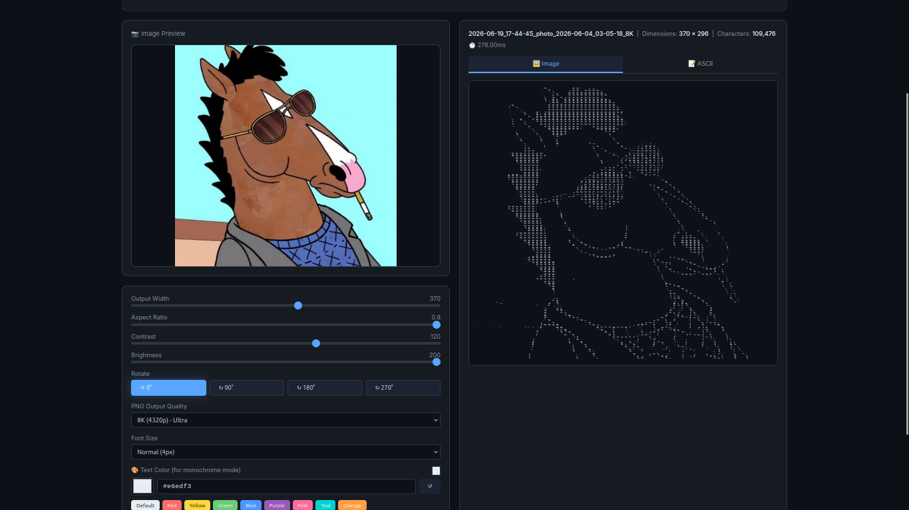
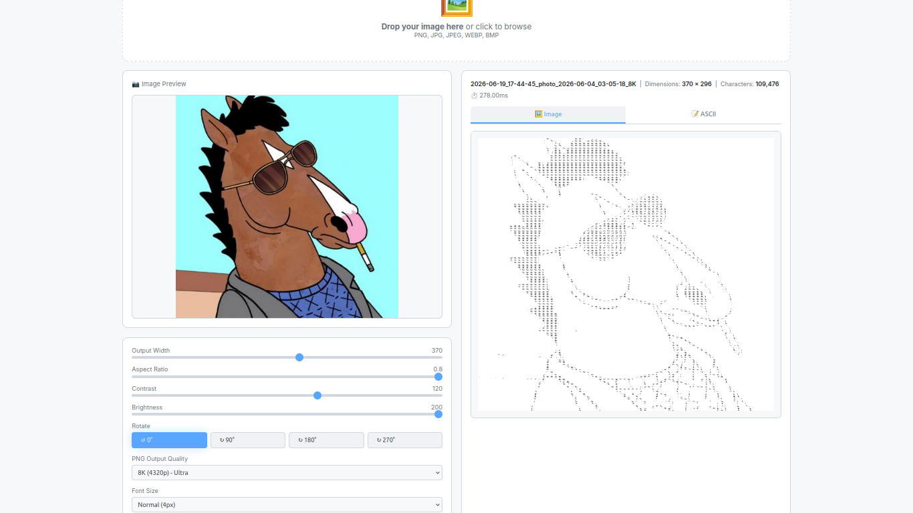
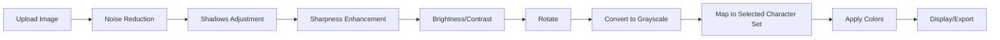

```markdown
# 🎨 ASCII Art Pro

<div align="center">


**Convert any image to stunning ASCII art with professional-grade quality**

[Features](#-features) • [Installation](#-installation) • [Usage](#-usage) • [Screenshots](#-screenshots) • [Advanced Options](#-advanced-options) • [Character Sets](#-character-sets) • [Contributing](#-contributing) • [License](#-license)

</div>

---

## 📖 Overview

**ASCII Art Pro** is a powerful, browser-based application that transforms images into high-quality ASCII art. Built with pure HTML, CSS, and JavaScript, it requires no external dependencies or server setup. Simply open the file in your browser and start creating stunning ASCII art from your images.

This is a **self-hosted ASCII Image Converter** designed for artists, computer enthusiasts, and anyone who wants to create beautiful ASCII art from their images. The project is completely **open-source** and **free** for everyone to use, modify, and distribute.

### 🎯 Key Capabilities

- **Image to ASCII Conversion** - Convert any image (PNG, JPG, JPEG, WEBP, BMP) to ASCII art
- **Real-time Preview** - See your ASCII art update instantly as you adjust settings
- **Multiple Export Formats** - Download as PNG, SVG, TXT, or standalone HTML
- **Professional Image Processing** - Built-in denoising, sharpening, and contrast enhancement
- **Full Color Support** - Preserve original image colors or use custom monochrome styles
- **Ultra-HD Quality** - Export up to 8K resolution (4320p) with lossless PNG format
- **Interactive Controls** - Adjust width, aspect ratio, contrast, brightness, and rotation
- **Dark/Light Theme** - Toggle between dark and light mode for comfortable viewing

---

## ✨ Features

### 🖼️ Image Processing

| Feature                 | Description                                                           |
| ----------------------- | --------------------------------------------------------------------- |
| **Smart Denoising**     | Removes image noise while preserving details using adaptive filtering |
| **Adaptive Sharpening** | Only sharpens edges, not the entire image, preventing artifacts       |
| **Unsharp Mask**        | Professional-grade sharpening technique for crisp ASCII output        |
| **Contrast Control**    | Adjust contrast from 0 to 200 for optimal clarity                     |
| **Brightness Control**  | Fine-tune brightness from 50% to 200%                                 |
| **Aspect Ratio**        | Customizable ratio (0.3 - 0.8) for different image proportions        |
| **Image Rotation**      | Rotate images 0°, 90°, 180°, or 270°                                  |

### 🎨 Color Management

| Feature             | Description                                                                         |
| ------------------- | ----------------------------------------------------------------------------------- |
| **Color Mode**      | Preserve original image colors in ASCII output                                      |
| **Monochrome Mode** | Convert to single color with customizable hex value                                 |
| **Color Picker**    | Visual color picker for selecting custom colors                                     |
| **Hex Input**       | Enter any hex color code (#RRGGBB)                                                  |
| **Color Presets**   | 8 predefined colors (Default, Red, Yellow, Green, Blue, Purple, Pink, Teal, Orange) |
| **Invert Colors**   | Reverse colors for negative effect                                                  |

---

## ⚙️ Advanced Options

The **Advanced Options** panel provides fine-grained control over image processing and ASCII generation. Click the `⚙️ Advanced Options` button to expand or collapse these settings.

### Image Adjustment Controls

| Setting             | Range      | Description                                                                                                    |
| ------------------- | ---------- | -------------------------------------------------------------------------------------------------------------- |
| **Output Width**    | 100 - 600  | Controls the width of the output ASCII art in pixels. Higher values = more detail, larger file size            |
| **Aspect Ratio**    | 0.3 - 0.8  | Adjusts the height-to-width ratio. Lower values create taller images, higher values create wider images        |
| **Contrast**        | 0 - 200    | Increases or decreases the contrast between light and dark areas. Higher values create more defined characters |
| **Brightness**      | 50% - 200% | Adjusts the overall brightness of the image. Higher values produce lighter output                              |
| **Sharpness**       | 0 - 100    | Enhances edge definition and detail. 0 = normal, 100 = maximum sharpening                                      |
| **Shadows**         | -50 to +50 | Adjusts shadow areas. Negative values darken shadows, positive values lighten them                             |
| **Noise Reduction** | 0 - 100    | Reduces image noise and grain. 0 = none, 100 = maximum smoothing                                               |

### How Advanced Options Work Together
```

Sharpness → Enhances edges and details
↓
Shadows → Adjusts dark areas for better visibility
↓
Noise Reduction → Smooths out unwanted grain and artifacts
↓
Brightness/Contrast → Final tone adjustment before ASCII conversion

````

---

## 🔤 Character Sets

ASCII Art Pro includes **5 pre-defined character sets** that determine which characters are used to build the ASCII art. You can switch between them in real-time to achieve different visual styles.

| Character Set | Characters | Use Case |
|---------------|------------|----------|
| **All Characters** (Default) | 86 characters including letters, numbers, symbols | Most detailed and nuanced output |
| **Binary Format** | ` ` (space), `1`, `0` | Minimalist, retro, or technical style |
| **A-Z Only** | Space + lowercase and uppercase letters | Clean, readable, text-only output |
| **0-9 Only** | Space + digits 0-9 | Numeric, data-like aesthetic |
| **Symbols Only** | Space + `.`, `,`, `:`, `;`, `!`, `?`, `+`, `-`, `=`, `*`, `/`, `\`, `\|`, `(`, `)`, `[`, `]`, `{`, `}`, `<`, `>`, `#`, `%`, `&`, `@`, `$` | Artistic, expressive, or coding style |

### Example Outputs by Character Set

| Set | Example Character Progression (Dark→Light) |
|-----|---------------------------------------------|
| All Characters | ` .:;!?+-=*/` → `abcdefghijklmnopqrstuvwxyz` → `ABCDEFGHIJKLMNOPQRSTUVWXYZ` → `#%&@$` |
| Binary Format | ` ` → `1` → `0` |
| A-Z Only | ` ` → `a b c d e f g...` → `A B C D E F G...` |
| 0-9 Only | ` ` → `1 2 3 4 5 6 7 8 9 0` |
| Symbols Only | ` ` → `. , : ; ! ? + - = * / \ | ( ) [ ] { } < > # % & @ $` |

---

## 📥 Export Options

| Format   | Quality    | File Size | Best For                       |
| -------- | ---------- | --------- | ------------------------------ |
| **PNG**  | Lossless   | 5-25 MB   | Printing, high-quality sharing |
| **SVG**  | Vector     | Small     | Scalable graphics, editing     |
| **TXT**  | Plain text | Small     | Copy-paste, text editors       |
| **HTML** | Standalone | Medium    | Web embedding, sharing         |

### 📊 Quality Options

| Quality                  | Resolution | Best For             |
| ------------------------ | ---------- | -------------------- |
| HD (720p)                | 1280×720   | Web use, small files |
| Full HD (1080p)          | 1920×1080  | Standard quality     |
| 2K (1440p)               | 2560×1440  | High quality         |
| **4K (2160p) - Default** | 3840×2160  | Professional quality |
| 8K (4320p) - Ultra       | 7680×4320  | Maximum quality      |

### ⌨️ Keyboard Shortcuts

| Shortcut           | Action                       |
| ------------------ | ---------------------------- |
| `Ctrl + Shift + C` | Copy ASCII text to clipboard |
| `Ctrl + Shift + D` | Download ASCII as TXT file   |
| `Ctrl + Enter`     | Process/refresh image        |
| `R`                | Rotate image 90° clockwise   |

---

## 🚀 Installation

### Method 1: Direct Download

```bash
# Download the files
wget https://raw.githubusercontent.com/ManiTeymouri/ASCII-Art/main/index.html
wget https://raw.githubusercontent.com/ManiTeymouri/ASCII-Art/main/style.css
wget https://raw.githubusercontent.com/ManiTeymouri/ASCII-Art/main/script.js

# Open in browser
open index.html
````

### Method 2: Clone Repository

```bash
git clone https://github.com/ManiTeymouri/ASCII-Art.git
cd ASCII-Art
open index.html
```

### System Requirements

- ✅ Any modern web browser (Chrome, Firefox, Edge, Safari, Opera)
- ✅ No installation required
- ✅ Works offline (no internet needed)
- ✅ No external dependencies
- ✅ No Node.js or npm required
- ✅ Cross-platform (Windows, macOS, Linux)

---

## 📖 Usage

### Basic Workflow

1. **Open** `index.html` in your browser
2. **Upload** an image (drag & drop or click to browse)
3. **Adjust** settings to your preference
4. **Preview** the result in the Image or ASCII tab
5. **Export** your art in the format you need

### Step-by-Step Guide

#### 1. Upload an Image

```
Click the drop zone or drag an image file into it
Supported formats: PNG, JPG, JPEG, WEBP, BMP
```

#### 2. Adjust Settings

**Basic Controls (Always Visible)**

- **Rotate** - Rotate image 0°, 90°, 180°, or 270°
- **PNG Output Quality** - Choose resolution (HD to 8K)
- **Font Size** - Adjust the size of ASCII characters in the output
- **Character Set** - Choose which characters to use for the ASCII art
- **Color Mode** - Use original image colors or monochrome
- **Invert Colors** - Reverse the color scheme

**Advanced Options (Click "⚙️ Advanced Options" to expand)**

- **Output Width** - Control output width (100-600 pixels)
- **Aspect Ratio** - Adjust height-to-width ratio (0.3-0.8)
- **Contrast** - Fine-tune contrast (0-200)
- **Brightness** - Adjust overall brightness (50-200%)
- **Sharpness** - Enhance edge definition (0-100)
- **Shadows** - Adjust dark areas (-50 to +50)
- **Noise Reduction** - Reduce image noise (0-100)

#### 3. Preview

Two tabs are available:

- **Image Tab**: Shows the ASCII art rendered as an image
- **ASCII Tab**: Shows the raw ASCII text (copyable)

#### 4. Export

Choose your output format:

| Button             | Format             | Use Case                   |
| ------------------ | ------------------ | -------------------------- |
| `📋 Copy`          | Plain text         | Paste into any text editor |
| `⬇️ Download TXT`  | Text file          | Save as plain text         |
| `📐 Download SVG`  | Vector graphic     | Scale without quality loss |
| `💎 Download PNG`  | High-quality image | Best quality, printing     |
| `🌐 Download HTML` | Web page           | Share as standalone page   |

---

## 📸 Screenshots

### Dark Mode Interface



### Light Mode Interface



### Advanced Options Panel


### Character Set Selection


### Image Preview Tab


### ASCII Output Tab


### Color Picker


### Export Options


---

## 🔧 Technical Details

### Processing Pipeline



### Character Sets

The tool includes **5 carefully curated character sets** for different visual styles:

| Character Set      | Number of Characters | Best For                    |
| ------------------ | -------------------- | --------------------------- |
| **All Characters** | 86                   | Maximum detail and nuance   |
| **Binary Format**  | 3                    | Minimalist, retro aesthetic |
| **A-Z Only**       | 53                   | Clean, readable output      |
| **0-9 Only**       | 11                   | Numeric, data-like style    |
| **Symbols Only**   | 27                   | Artistic, coding aesthetic  |

### All Characters Set (86 characters)

```
Space, ., ,, :, ;, !, ?, +, -, =, *, /, \, |, (, ), [, ], {, }, <, >,
1, 2, 3, 4, 5, 6, 7, 8, 9, 0,
a-z, A-Z,
#, %, &, @, $
```

---

## 🛠️ Customization

### Adding a New Character Set

Edit the `CHARACTER_SETS` object in `script.js`:

```javascript
const CHARACTER_SETS = {
  // ... existing sets ...
  custom: {
    name: "My Custom Set",
    chars: [" ", "@", "#", "$", "%", "&", "*", "!"],
  },
};
```

### Changing the Character Set

Edit the `ASCII_CHARS` array in `script.js`:

```javascript
const ASCII_CHARS = [
  " ",
  ".",
  ",",
  ":",
  ";",
  "!",
  "?",
  "+",
  "-",
  "=",
  // Add your own characters here
  // More characters = more detail
  // Fewer characters = more contrast
];
```

### Adding Custom Color Presets

Add new color presets in the HTML:

```html
<button
  class="btn color-preset"
  data-color="#YOUR_COLOR"
  style="background:#YOUR_COLOR; color:white; padding:4px 10px; font-size:0.75rem;">
  Your Color Name
</button>
```

### Modifying Default Settings

Change the default values in `index.html`:

```html
<!-- Change default width -->
<input
  type="range"
  id="widthSlider"
  min="100"
  max="600"
  value="400"
  step="10" />

<!-- Change default aspect ratio -->
<input
  type="range"
  id="ratioSlider"
  min="0.3"
  max="0.8"
  value="0.8"
  step="0.01" />

<!-- Change default contrast -->
<input type="range" id="contrastSlider" min="0" max="200" value="90" step="5" />
```

---

## 📊 Performance

### Processing Times

| Image Size | Width Setting | Time (ms) | Notes      |
| ---------- | ------------- | --------- | ---------- |
| 1 MP       | 200           | ~50ms     | Very fast  |
| 5 MP       | 400           | ~150ms    | Fast       |
| 12 MP      | 500           | ~300ms    | Good       |
| 24 MP      | 600           | ~600ms    | Acceptable |

### Memory Usage

| Quality         | Memory (MB) | Notes            |
| --------------- | ----------- | ---------------- |
| HD (720p)       | ~5 MB       | Low memory       |
| Full HD (1080p) | ~15 MB      | Moderate         |
| 4K (2160p)      | ~50 MB      | High memory      |
| 8K (4320p)      | ~200 MB     | Very high memory |

---

## 🌐 Browser Support

| Browser        | Version | Support |
| -------------- | ------- | ------- |
| Chrome         | 80+     | ✅ Full |
| Firefox        | 75+     | ✅ Full |
| Edge           | 80+     | ✅ Full |
| Safari         | 13+     | ✅ Full |
| Opera          | 67+     | ✅ Full |
| Safari iOS     | 13+     | ✅ Full |
| Chrome Android | 80+     | ✅ Full |

---

## 🤝 Contributing

**ASCII Art Pro** is completely **open-source** and we welcome contributions from everyone! Whether you're a developer, designer, or just someone with a great idea, your contributions are valued.

### How to Contribute

1. **Fork** the repository
2. **Clone** your fork: `git clone https://github.com/ManiTeymouri/ASCII-Art.git`
3. **Create** a new branch: `git checkout -b feature/your-feature`
4. **Make** your changes
5. **Commit** your changes: `git commit -m "Add some feature"`
6. **Push** to your fork: `git push origin feature/your-feature`
7. **Submit** a pull request

### Types of Contributions

- 🐛 **Bug Reports** - Found a bug? Let me know!
- 💡 **Feature Suggestions** - Have an idea? We'd love to hear it!
- 📝 **Documentation** - Help improve our docs
- 🎨 **Design** - Improve the UI/UX
- 💻 **Code** - Fix bugs or add features

### Development Setup

```bash
# Clone the repository
git clone https://github.com/ManiTeymouri/ASCII-Art.git
cd ASCII-Art

# Open in your favorite editor
code .

# Start a local server (optional)
python3 -m http.server 8000
# or
npx serve
```

---

## 📄 License

This project is licensed under the **MIT License** - see the [LICENSE](LICENSE) file for details.

```
MIT License

Copyright (c) 2026 ManiTeymouri

Permission is hereby granted, free of charge, to any person obtaining a copy
of this software and associated documentation files (the "Software"), to deal
in the Software without restriction, including without limitation the rights
to use, copy, modify, merge, publish, distribute, sublicense, and/or sell
copies of the Software, and to permit persons to whom the Software is
furnished to do so, subject to the following conditions:

The above copyright notice and this permission notice shall be included in all
copies or substantial portions of the Software.

THE SOFTWARE IS PROVIDED "AS IS", WITHOUT WARRANTY OF ANY KIND, EXPRESS OR
IMPLIED, INCLUDING BUT NOT LIMITED TO THE WARRANTIES OF MERCHANTABILITY,
FITNESS FOR A PARTICULAR PURPOSE AND NONINFRINGEMENT. IN NO EVENT SHALL THE
AUTHORS OR COPYRIGHT HOLDERS BE LIABLE FOR ANY CLAIM, DAMAGES OR OTHER
LIABILITY, WHETHER IN AN ACTION OF CONTRACT, TORT OR OTHERWISE, ARISING FROM,
OUT OF OR IN CONNECTION WITH THE SOFTWARE OR THE USE OR OTHER DEALINGS IN THE
SOFTWARE.
```

---

## 🙏 Acknowledgments

- Inspired by classic ASCII art generators and the creativity of the open-source community
- Built with pure vanilla JavaScript for maximum compatibility and performance
- Designed with GitHub's dark theme aesthetic for comfortable coding sessions

---

<div align="center">

**Made with ❤️ by [ManiTeymouri](https://github.com/ManiTeymouri)**

[⬆ Back to Top](#-Ascii-Art-Pro)

</div>

---
